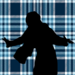
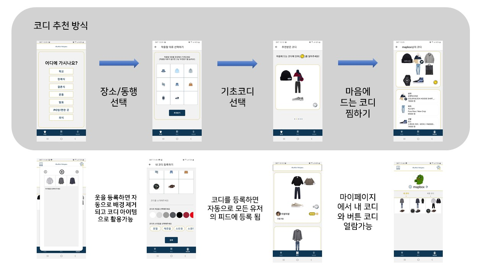
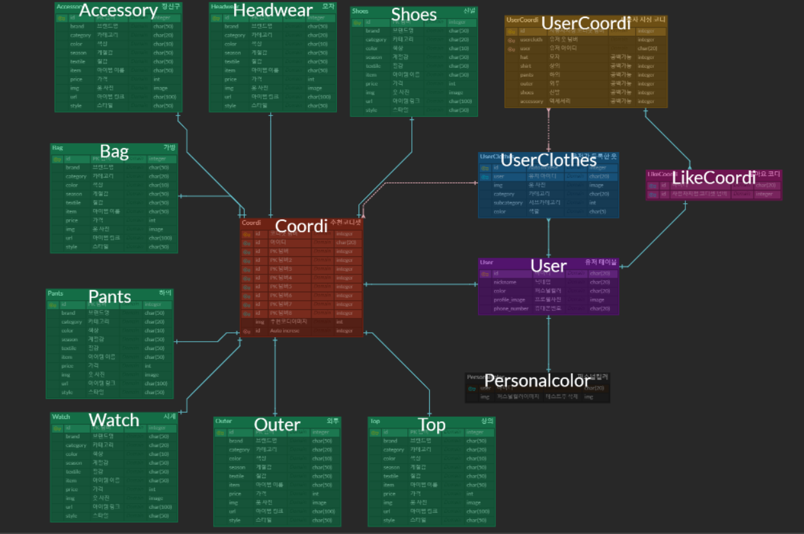
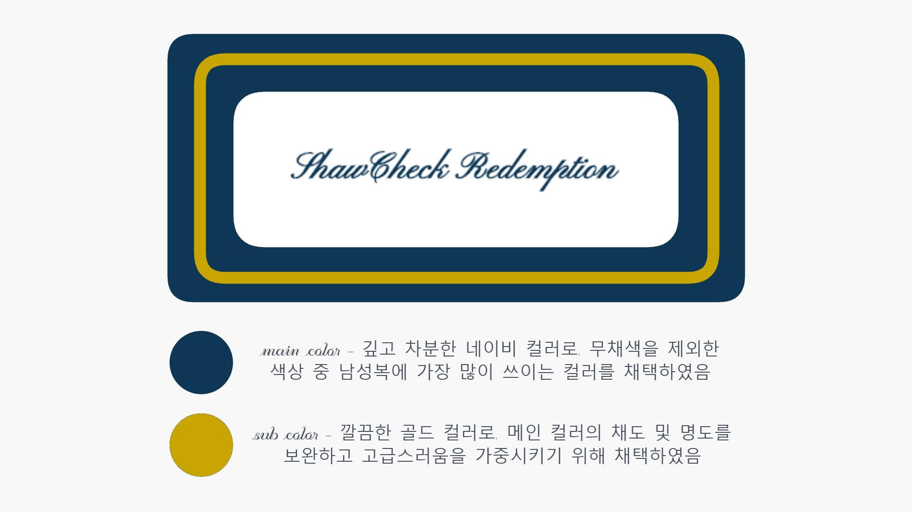
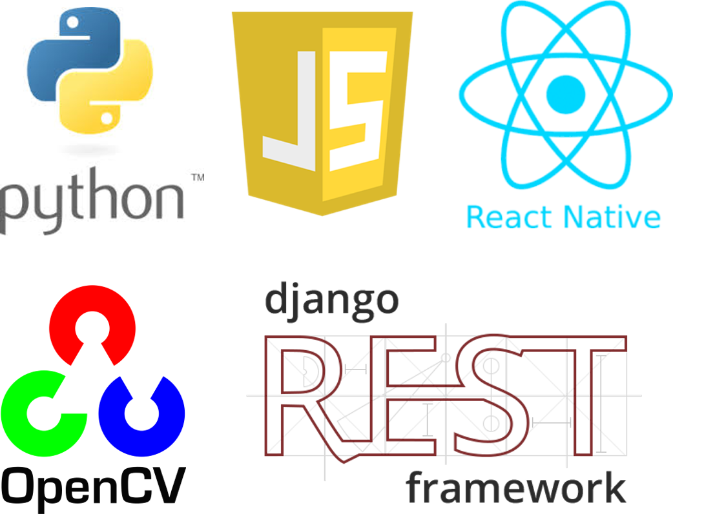

# 쇼체크 탈출

- 목적: 패션에 큰 관심이 없는 20대 남성을 위한 AI 기반의 코디 추천 서비스

- 개발 기간: 20.10.12. ~ 20.11.16.

- [배포 링크](https://play.google.com/store/apps/details?id=com.jokyuseong.HeoSeongSoo)

---

## 목차

- [1. 프로젝트 계획 및 계획서](#프로젝트-계획-및-계획서)

- [2. 팀 구성원 및 업무 분장](#팀-구성원-및-업무-분장)

- [3. 와이어 프레임](#와이어-프레임)
- [4. DB 모델링](#DB-모델링)
- [5. 핵심 기능](#핵심-기능)
- [6. 개발 스택 및 프레임 워크](#개발-스택-및-프레임-워크)

---

## 프로젝트 계획 및 계획서

- [계획서.pdf](doc/계획서.pdf)

1. 주요 고객층 선정
   - 패션에 큰 관심이 없는 20대 남성
   - 옷(패션)을 어려워하는 사람.
   - 특정 상황/컨셉에 맞는 옷차림을 입고 싶어한다.
2. 이미지 메이킹(퍼스널컬러) 색상 가중치(유저 정보)를 활용한 코디 추천

3. 일정에 맞는 코디세트 추천
   - 만나는 사람과 상황에 따른 코디 추천
     - 만나는 사람: 혼자 / 친구 / 여사친 / 교수님 등
     - 상황: 학교 / 아르바이트 / PC방 / 발표 및 프레젠테이션 / 결혼식 / 장례식 등
4. 유저의 코디 중 좋아요를 50개 이상 받은 코디는 추천 set에 추가

---

## 팀 구성원 및 업무 분장

**박도희**

- 팀장
- 웹 크롤링, 이미지프로세싱

**조규성**

- 부팀장
- Frontend 전반

**박인영**

- 깃마스터, 디자인
- 추천 알고리즘 설계

**허성수**

- Backend API 전반
- 이미지 해싱

---

## 와이어 프레임



- [와이어프레임.pdf](doc/와이어프레임.pdf)
- [화면설계.pdf](doc/화면설계.pdf)

---

## DB 모델링



---

## 컬러 디자인



---

## 핵심 기능

**기존의 천편일률적인 코디셋 추천에서 나아가 내가 가진 옷을 바탕으로 각 유저의 퍼스널컬러와 유저의 TPO에 맞추어 코디 추천**


### 이미지 전처리

>  OpenCV를 사용해 유저가 올린 이미지의 배경을 지우고 중앙 정렬 및 저장

```markdown
INPUT: 의류 아이템이 있는 사진(jpg)

1. 외곽선 검출 및 배경 제거
   - 가우시안 필터로 블러링(평활화)을 해 잡음 제거
   - Canny Edge Detection을 통해 이미지 외곽선 검출
   - 마스크 작업을 위한 마스크 생성 뒤, 비트와이즈 연산으로 이미지 추출
2. 색상 추출
   - 배경이 제거된 이미지를 HSV 채널로 분할한 뒤, 각 픽셀의 HSV값을 카운트
   - 최빈값의 HSV와 기준이 되는 색상들의 HSV값과의 유클리디언(Euclidean) 거리를 계산해 가장 가까운 색상을 현재 아이템의 색상으로 반환
3. 아이템 트리밍(trimming)
   - 배경이 제거된 이미지의 x좌표 최소값, 최대값, y좌표 최소값, 최대값을 구한 뒤, 해당 영역의 이미지 자름
4. 정방형으로 변환
   - 3의 과정이 끝난 이미지의 가로가 더 길다면 가로*가로 크기의 빈 이미지를 생성한 뒤, 중앙에 3의 이미지가 들어갈 수 있도록 배치
   - 세로가 더 길다면 세로*세로 크기의 빈 이미지를 생성한 뒤, 중앙에 3의 이미지가 들어갈 수 있도록 배치
   - 이 때 빈 이미지는 4차원으로 생성
5. 이미지 리사이즈
   - 4의 과정이 끝난 이미지를 150*150 크기의 이미지로 변환
   - 이미지를 줄이기 위해 영역 보간법(INTER_AREA)를 사용
6. 이미지 저장

OUTPUT: 2에서 추출한 색상, 알고리즘을 마친 이미지가 저장된 주소
```

### 추천 알고리즘 동작 과정

#### 1. 퍼스널 컬러 진단

```markdown
소스코드 참고 ( https://github.com/starbucksdolcelatte/ShowMeTheColor )

OpenCV와 Dlib 라이브러리를 이용하여 사용자의 사진에서 눈동자, 뺨, 눈썹의 영영을 인식하고
각 영역에 대하여 k-means 알고리즘을 통해 대표 색상을 추출 후
Lab b값(푸른 정도)과 HSV S값(채도)을 이용해 봄 / 여름 / 가을 / 겨울 중 하나로 진단.
진단 작업은 사용자 사진의 색상과 기준 색상의 차이를 구한 후
피부, 눈썹, 눈동자별로 설정된 가중치를 곱하여 합한 값을 비교.
합이 작은 계절이 질의 사진의 퍼스널컬러 결과로 도출됨
```

#### 2. 스타일 분류

```markdown
사용자가 장소(where)와 동행(who)을 선택하면 각 스타일에 점수를 더함.
가장 점수가 높은 스타일을 first_style, 두번째로 높은 스타일을 second_style로 매겨
아이템 추천 시 스타일이 일치하는지에 따라 first_style은 50점, second_style은 25점을 부여함

## 스타일 분류

- formal (정장 스타일. 격식을 차리는 상황에 추천됨)
- dandy (포멀과 캐주얼 사이의 스타일. 편안하지만 옷차림에 어느정도 신경쓰이는 상황에 추천됨)
- casual (일상적인 옷차림. 캠퍼스룩이나 편안하고 제약이 없는 상황에 추천됨)
- street (현재 패션 트렌드를 반영한 스타일. 포멀을 제외한 나머지 분류와 어우러질 수 있음)
- sporty (운동 또는 활동적인 상황에 추천되는 스타일)

## 장소(where)

- 학교
- 장례식
- 결혼식
- 운동
- 발표
- PC방 / 편한 곳
- 외식

## 동행(who)

- 교수님 (target age 범위를 넓히면 직장 상사도 포함)
- 여사친
- 친구 / 혼자
- 가족
```

#### 3. 계절 분류

```markdown
3~5월 : 봄(spring)
6~8월 : 여름(summer)
9~11월 : 가을(fall)
12~2월 : 겨울(winter)

현재 알고리즘은 위의 네 분류로 나누어 필터링 및 점수 부여(30점)를 하지만,
차후 각 계절 사이에 중간값을 채워 총 여덟 분류로 나누어
현재 기온을 기준으로 추천하도록 알고리즘 세분화 가능
```

#### 4. 이미지 유사도 분석

```markdown
target_item : 유저가 선택한 아이템의 이미지
image_list : DB에서 target_item과 세부 카테고리, 색상이 일치하는 아이템을 뽑은 리스트(array)

image_list를 for문으로 돌며 target_item과 유사도 분석 후 점수를 매겨
가장 점수가 낮은(차이가 없는)순으로 5개를 추출

- 분석 방법 : image hash 기법을 통해 유저가 올린 사진과 DB의 데이터간 유사도 분석
```

#### 5. 퍼스널 컬러 응용

```markdown
사용자의 퍼스널 컬러와 상관없이 아이템에 자주 쓰이는 색상을 기본 값으로 두고,
퍼스널 컬러에 따른 특정 컬러를 추가하여 리스트(array)를 만든다.
아이템의 색상이 해당 리스트에 포함되어 있다면 10점을 더한다.

필수값 = ["검정색", "흰색", "회색", "라이트 그레이", "다크 그레이",
"아이보리", "네이비", "데님", "연청", "중청", "진청", "흑청"]

봄웜톤 추가값 = ["라즈베리", "페일 핑크", "코랄", "노란색", "머스타드", "금색",
"라이트 그린", "민트", "올리브 그린", "네온 블루", "라벤더", "갈색", "로즈 골드",
"레드 브라운", "카키 베이지", "카멜", "샌드", "베이지색"]

여름쿨톤 추가값 = ["라이트 핑크", "피치", "라이트 옐로우", "네온 그린", "민트",
"스카이 블루", "라벤더", "베이지색"]

가을웜톤 추가값 = ["딥레드", "오렌지 핑크", "카키", "다크 그린", "자주", "보라색",
"다크 바이올렛", "버건디", "갈색", "로즈 골드", "레드 브라운", "카키 베이지", "카멜"]

겨울쿨톤 추가값 = ["은색", "빨간색", "네온 핑크", "분홍색", "라이트 오렌지",
"네온 오렌지", "주황색", "녹색", "네온 블루", "파란색", "샌드"]
```

#### 6. 연관 아이템 응용

```markdown
상의(top)와 시계(watch)를 제외한 각 아이템은 연관 아이템(이하 부모라고 칭함)이 있다.
하의(pants), 외투(outer), 액세서리(acc)는 상의(top)를 부모로 두고,
신발(shoes)은 하의(pants)를 부모로 둔다.
가방(bag), 모자(headwear)는 신발(shoes)을 부모로 둔다.

각 아이템은 부모 아이템의 색상에 영향을 받으며,
아이템에 따라 구현된 알고리즘은 다르다.
예를 들어 하의 아이템을 추출할 때, 상의 아이템에 적용된 색상은 모두 마이너스 점수를 받는다.
단, 검정색의 경우에는 예외처리한다.
그러나 가방 아이템을 추출할 때에는 부모인 신발 아이템에 적용된 색상은 가중 점수를 받는다.
```

#### 7. 필터링과 점수화

```markdown
### 필터링

아이템의 세부 카테고리를 제한하는 것을 필터링이라 한다.
유저가 입력한 아이템이 있을 때에는 세부 카테고리가 하나이므로 따로 필터링을 거치지 않는다.
유저가 입력한 아이템이 없을 경우에는 현재 계절과 스타일(where과 who로 뽑아낸 TPO 가중치)에 따라
세부 카테고리를 필터링한다.
예를 들어 상의의 경우에는 세부 카테고리에
{"반팔티", "긴팔티", "민소매", "셔츠", "카라티", "맨투맨", "후드", "니트"}가 있으며,
현재 계절이 겨울일 경우 반팔티와 민소매를 제외시킨다.
그리고 first_style이 formal일 경우 셔츠를 제외한 나머지 카테고리는 모두 뺀다.

### 점수화

필터링과 마찬가지로 유저가 입력한 아이템이 없을 경우에만 점수화를 적용한다.
퍼스널 컬러, 스타일, 계절, 부모 아이템 컬러, 그 외 특수사항을 모두 점수화한다.
예를 들어 하의의 경우 필터링 후 남은 카테고리가 {코튼, 슬랙스}라면,
해당 세부 카테고리의 아이템을 모두 리스트(array)에 담고 for문으로 하나씩 꺼내어 점수를 매긴다.
유저의 퍼스널 컬러와 일치하는 색상이 있다면 +10점,
스타일이 first_style과 일치한다면 +50점, second_style과 일치한다면 +25점,
계절감이 현재 계절과 일치한다면 +30점,
부모 아이템에 어울리지 않는 색상을 danger라는 리스트(array)로 만들어
해당 색상이 포함되면 0점으로 초기화 한다.
또한 결혼식, 장례식에는 검정색 아이템이 아니라면 모두 0점으로 만드는 등
특수사항도 고려한다.

이렇게 매긴 점수를 내림차순으로 정렬하여 위에서부터 최소 5개를 뽑아
(점수 차이가 나지 않을 경우 5개가 넘을 수 있다.)
다양성을 위해 랜덤으로 하나를 뽑는다.
```

---

## 개발 스택 및 프레임 워크



---
